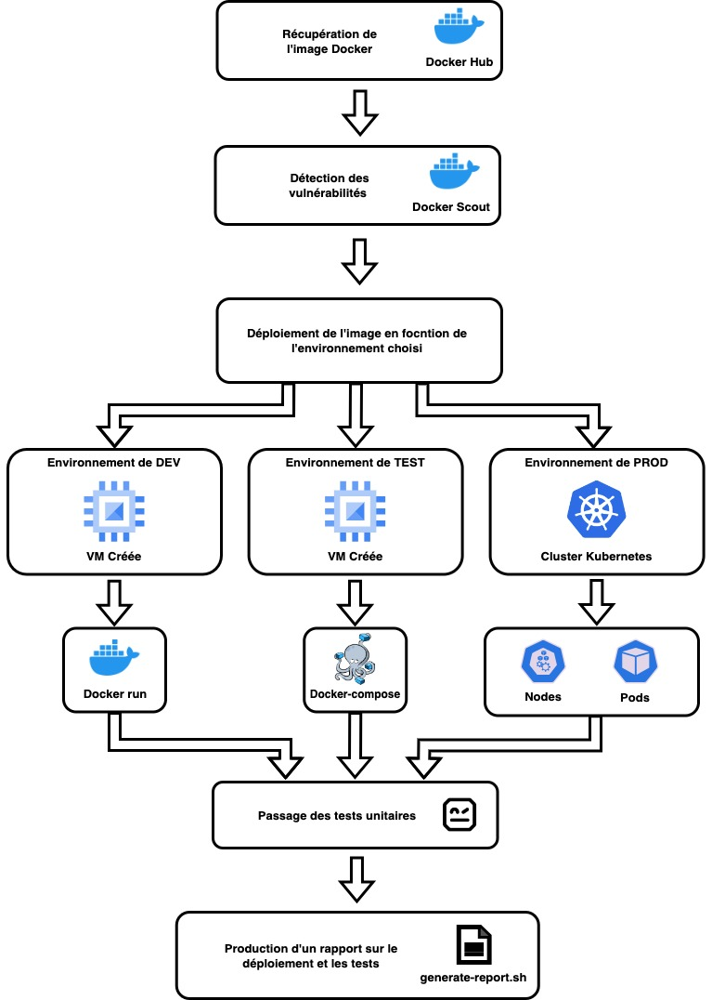

# Documentation du pipeline CI/CD pour une application Python

  Ce README explique le cheminement d'une pipeline CI/CD pour une application python.

## Répertoires de Déploiement

  ``` shell
  . # Arborescence du repository
  ├── Dockerfile
  ├── README.md
  ├── build-image-devops.sh
  ├── configure_runner.sh
  ├── deploy-dev
  │   ├── README.md
  │   ├── ansible
  │   │   ├── ansible.cfg
  │   │   ├── inventory.ini
  │   │   ├── playbook.yml
  │   │   ├── roles
  │   │   │   └── vm-dev
  │   │   │       ├── handlers
  │   │   │       │   └── main.yml
  │   │   │       └── tasks
  │   │   │           └── main.yml
  │   │   └── vars.yml
  │   ├── creation-inventory.sh
  │   ├── credentials.json
  │   ├── deploy.sh
  │   ├── terraform
  │   │   ├── firewall
  │   │   │   ├── main.tf
  │   │   │   ├── outputs.tf
  │   │   │   └── variables.tf
  │   │   ├── main.tf
  │   │   ├── outputs.tf
  │   │   ├── service_account
  │   │   │   ├── main.tf
  │   │   │   ├── outputs.tf
  │   │   │   └── variables.tf
  │   │   ├── terraform.tfstate
  │   │   ├── terraform.tfstate.backup
  │   │   ├── variables.tf
  │   │   ├── vm-dev
  │   │   │   ├── main.tf
  │   │   │   ├── outputs.tf
  │   │   │   └── variables.tf
  │   │   └── vpc
  │   │       ├── main.tf
  │   │       ├── outputs.tf
  │   │       └── variables.tf
  │   └── terraform-destroy.sh
  ├── deploy-prod
  │   ├── README.md
  │   ├── ansible
  │   │   ├── ansible.cfg
  │   │   ├── inventory.ini
  │   │   ├── playbook.yml
  │   │   ├── roles
  │   │   │   └── gke-cluster
  │   │   │       ├── handlers
  │   │   │       │   └── main.yml
  │   │   │       └── tasks
  │   │   │           └── main.yml
  │   │   └── vars.yml
  │   ├── creation-inventory.sh
  │   ├── credentials.json
  │   ├── deploy.sh
  │   ├── k8s-config.yml
  │   ├── terraform
  │   │   ├── credentials.json
  │   │   ├── firewall
  │   │   │   ├── main.tf
  │   │   │   ├── outputs.tf
  │   │   │   └── variables.tf
  │   │   ├── gke-cluster
  │   │   │   ├── main.tf
  │   │   │   ├── outputs.tf
  │   │   │   └── variables.tf
  │   │   ├── main.tf
  │   │   ├── outputs.tf
  │   │   ├── service_account
  │   │   │   ├── main.tf
  │   │   │   ├── outputs.tf
  │   │   │   └── variables.tf
  │   │   ├── terraform.tfstate
  │   │   ├── terraform.tfstate.backup
  │   │   ├── variables.tf
  │   │   └── vpc
  │   │       ├── main.tf
  │   │       ├── outputs.tf
  │   │       └── variables.tf
  │   └── terraform-destroy.sh
  ├── deploy-test
  │   ├── README.md
  │   ├── ansible
  │   │   ├── ansible.cfg
  │   │   ├── inventory.ini
  │   │   ├── playbook.yml
  │   │   ├── roles
  │   │   │   └── vm-test
  │   │   │       ├── handlers
  │   │   │       │   └── main.yml
  │   │   │       └── tasks
  │   │   │           └── main.yml
  │   │   └── vars.yml
  │   ├── creation-inventory.sh
  │   ├── credentials.json
  │   ├── deploy.sh
  │   ├── terraform
  │   │   ├── firewall
  │   │   │   ├── main.tf
  │   │   │   ├── outputs.tf
  │   │   │   └── variables.tf
  │   │   ├── main.tf
  │   │   ├── outputs.tf
  │   │   ├── service_account
  │   │   │   ├── main.tf
  │   │   │   ├── outputs.tf
  │   │   │   └── variables.tf
  │   │   ├── terraform.tfstate
  │   │   ├── terraform.tfstate.backup
  │   │   ├── variables.tf
  │   │   ├── vm-test
  │   │   │   ├── main.tf
  │   │   │   ├── outputs.tf
  │   │   │   └── variables.tf
  │   │   └── vpc
  │   │       ├── main.tf
  │   │       ├── outputs.tf
  │   │       └── variables.tf
  │   └── terraform-destroy.sh
  ├── docker-compose.yml
  ├── pipeline-cd.jpg
  └── tp_4_CD.pdf
  ```

  - `deploy-dev`, `deploy-prod`, `deploy-test` : Répertoires pour le déploiement dans différents environnements.
    - **ansible** : Contient des configurations et des scripts Ansible pour le déploiement et la configuration des VMs et du cluster déployés.
    - **terraform** : Contient des configurations Terraform pour le provisionnement d'infrastructures dans les différents environnements.
    - **deploy.sh** : Script pour déployer votre application en utilisant Terraform et Ansible.
    - **terraform-destroy.sh** : Script pour détruire l'infrastructure créée avec Terraform.
    - **credentials.json** : Fichier de configuration contenant des informations d'identification pour se connecter à votre compte GCP.
    - **creation-inventory.sh** : Script pour générer un fichier d'inventaire Ansible à partir de votre infrastructure.

## Fichier de Configuration GitLab CI/CD

  - `.gitlab-ci.yml` : Définit les étapes du pipeline CI/CD, y compris la récupération d'image, la vérification des vulnérabilités, le déploiement, la récupération d'IP et de port, les tests fonctionnels et la génération.

## Configuration du Runner GitLab

  - `configure_runner.sh` : Script shell pour automatiser la configuration d'un GitLab Runner.

## Fichier Docker-Compose

  - `docker-compose.yml` : Définit les conteneurs Docker nécessaires pour exécuter le pipeline CI/CD, y compris GitLab et GitLab Runner.

## Schéma Visuel

  - `pipeline-cd-schema/pipeline-cd.jpg` : Schéma visuel de la pipeline d'intégration continue CI/CD.

## Script de Construction d'Image Docker

  - `build-image-devops.sh` : Script shell pour automatiser la construction d'une image Docker personnalisée avec tous les outils DevOps pour une utilisation dans la chaîne de déploiement CI/CD.

## Fichiers de Configuration

  - `Dockerfile` : Fichier de build pour l'image Docker personnalisée DevOps.
  - `tp_4_CD.pdf` : Document de présentation du TP4.

Ces fichiers et répertoires sont essentiels pour mettre en place et exécuter votre pipeline CI/CD avec GitLab. Assurez-vous de configurer et personnaliser ces éléments en fonction des besoins de votre projet.


## Schéma visuel d'un pipeline d'intégration continue

  

# Configuration des Paramètres du Pipeline CI/CD

  Ce document détaille les paramètres configurables du pipeline CI/CD en définissant des variables dans le fichier `.gitlab-ci.yml`.

  ## Étape "retrieve_image"

  - `DOCKER_REGISTRY` : L'URL du registre Docker pour stocker l'image Docker (par défaut, "docker.io" est le registre Docker public).
  - `DOCKER_USER` : Le nom d'utilisateur du compte Docker Hub.
  - `DOCKER_REPO` : Le nom du repository Docker où est stockée l'image Docker.
  - `DOCKER_IMAGE_VERSION` : Le nom de la version de l'image construite et poussée sur le Hub Docker.
  - `IMAGE_REPO_PATH` : Le chemin où l'artifact de l'image Docker sera enregistré.
  - `IMAGE_OS` : L'image Docker utilisée pour les jobs de la pipeline.

## Étape "check_vulnerabilities"

  - `CHECK_VULNERABILITIES_REPORT_PATH` : Le chemin vers les rapports de vérification de vulnérabilités.

## Étape "deploy"

  - `ENVIRONMENT_TYPE` : Le type d'environnement cible (dev, test, prod).

## Étape "retrieve_ip_and_port" (Dev)

  - `GCLOUD_PROJECT_ID` : L'ID du projet Google Cloud.
  - `GCLOUD_ZONE` : La zone Google Cloud.
  - `VM_NAME` : Le nom de la machine virtuelle.
  - `CONTAINER_NAME` : Le nom du conteneur Docker.
  - `IMAGE_NAME` : Le nom de l'image Docker.

## Étape "functional_test"

  - `ROBOTFRAMEWORK_REPORT_PATH` : Le chemin vers les rapports Robotframework.
  - `ROBOTFRAMEWORK_FILE` : Le chemin des fichiers de tests fonctionnels Robotframework.

  Personnalisez ces variables en fonction des besoins de votre projet pour configurer le pipeline CI/CD de manière adéquate.

# Étapes du Pipeline CI/CD

  Le pipeline CI/CD est composé de 6 étapes pour automatiser le développement, les tests et la livraison d'une application tout en garantissant la qualité du code et la génération de rapports détaillés.

## Étape "retrieve_image"

  - Cette étape vise à récupérer une image Docker depuis un registre (par exemple, Docker Hub) et à la stocker localement pour une utilisation ultérieure.

## Étape "check_vulnerabilities"

  - Dans cette étape, nous vérifions les vulnérabilités de l'image Docker en utilisant Scout-CLI. Les rapports de vulnérabilités sont enregistrés pour une évaluation ultérieure.

## Étapes de déploiement ("deploy_dev, deploy_test, deploy_prod")

  - Ces étapes sont responsables du déploiement de l'application dans différents environnements (développement, test, production) en fonction de la valeur de la variable ENVIRONMENT_TYPE. Chacune de ces étapes déploie l'application sur une plateforme spécifique.

## Étapes de récupération d'adresse IP et de port ("retrieve_ip_and_port_dev, retrieve_ip_and_port_test, retrieve_ip_and_port_prod")

  - Ces étapes récupèrent l'adresse IP et le port de l'application déployée dans chaque environnement. Cela permet de connaître l'emplacement de l'application pour effectuer des tests ou des validations ultérieures.

## Étape "functional_test"

  - Cette étape exécute des tests fonctionnels à l'aide de Robot Framework. Les résultats des tests sont enregistrés dans un répertoire spécifique.

## Étape "generate_global_report"

  - Cette dernière étape compile les informations des tests précédents. Elle récupère les adresses IP et les ports en fonction de l'environnement. Elle crée un fichier de rapport au format HTML en utilisant les informations compilées. Le rapport est ensuite archivé en tant qu'artefact avec des dépendances sur les étapes précédentes.

  Ce pipeline CI/CD vise à automatiser le processus de développement, du test à la livraison, tout en garantissant la qualité du code et en fournissant des rapports complets pour chaque étape du pipeline.

  # Exécution du Pipeline CI/CD

  Pour exécuter ce pipeline sur GitLab, suivez ces étapes :

  1. Clonez le dépôt GitLab en local en utilisant la commande suivante :

      ```bash
      git clone https://github.com/HunterduBled/TP4-CD.git
      ```

  2. Configurez une variable d'environnement $GITLAB_HOME pointant vers le répertoire où se trouvera la configuration, les journaux et les fichiers de données. Assurez-vous que le répertoire existe et que les autorisations appropriées ont été accordées. Par exemple, pour les utilisateurs Linux, définissez le chemin sur /srv/gitlab :

      ```bash
      export GITLAB_HOME=/srv/gitlab
      ```

  3. Lancez le conteneur Docker-Compose en exécutant la commande suivante :

      ```bash
      docker-compose up -d
      ```

      Attendez que les deux conteneurs (GitLab et GitLab Runner) soient en état "Up". Vous pouvez vérifier leur état en utilisant la commande :

      ```bash
      docker-compose ps
      ```

  4. Accédez à votre instance GitLab en ouvrant votre navigateur et en entrant l'URL suivante : [http://localhost:8080](http://localhost:8080). Connectez-vous en utilisant le nom d'utilisateur **"root"** et le mot de passe que vous pouvez obtenir en exécutant la commande suivante :

      ```bash
      docker exec -it gitlab-ce grep 'Password:' /etc/gitlab/initial_root_password
      ```

  5. Avant de continuer, il est recommandé de modifier quelques paramètres de GitLab. Voici les étapes à suivre :

      - Désactivez l'inscription ouverte pour tout le monde. Pour ce faire, cliquez sur le bouton "Afficher les paramètres" disponible dans la barre supérieure avec un avertissement. Sur la nouvelle page, décochez la case "Inscription activée" et enregistrez les modifications.

      - Changez l'utilisateur root. Pour ce faire, rendez-vous sur la page de votre profil en utilisant le lien suivant : [http://localhost:8080/-/profile/account](http://localhost:8080/-/profile/account), puis modifiez le nom d'utilisateur comme souhaité.

      - Changez le mot de passe de l'utilisateur root en vous rendant sur la page : [http://localhost:8080/-/profile/password/edit](http://localhost:8080/-/profile/password/edit) et en entrant le nouveau mot de passe.

  6. Pour permettre l'importation de projets, assurez-vous d'activer les sources d'importation dans les paramètres de GitLab. Pour ce faire, suivez ces étapes :

      - Connectez-vous à GitLab en tant qu'utilisateur avec un niveau d'accès administrateur.

      - Dans la barre latérale de gauche, sélectionnez "Search or go to" (Rechercher ou aller à).

      - Choisissez "Admin Area" (Zone d'administration).

      - Sélectionnez "Settings > General" (Paramètres > Général).

      - Développez la section "Import and export settings" (Paramètres d'importation et d'exportation).

      - Sélectionnez chaque source d'importation à activer (dans notre cas : "Repository by URL" pour importer un projet à partir d'une URL).

      - Cliquez sur "Save changes" (Enregistrer les modifications).

  7. Créez un nouveau projet sur GitLab en utilisant l'URL du dépôt Git à cloner [https://github.com/HunterduBled/TP4-CD.git]. Vous pouvez le faire en suivant ces étapes :

      - Connectez-vous à GitLab.

      - Cliquez sur le logo GitLab (Homepage) puis sur "Create Project" (Création de projet).

      - Sélectionnez "Import project" (Importer un projet).

      - Choisissez "Repository by URL" et entrez l'URL du dépôt Git à cloner.

      - Cliquez sur "Create project" (Créer un projet).

  8. Ajoutez une variable d'environnement sensible $DOCKER_TOKEN sur GitLab en suivant ces étapes :

      - Connectez-vous à votre compte Docker Hub.

      - Cliquez sur votre avatar en haut à droite, puis sur "Account Settings" (Paramètres du compte).

      - Dans le menu de gauche, cliquez sur "Security" (Sécurité).

      - Cliquez sur "New Access Token" (Nouveau jeton d'accès).

      - Entrez un nom pour le jeton d'accès, puis cliquez sur "Create" (Créer).

      - Copiez le jeton d'accès généré et conservez-le en lieu sûr.

      - Ensuite, allez dans votre projet sur GitLab.

      - Cliquez sur "Settings" (Paramètres) dans le menu de gauche, puis sur "CI/CD".

      - Dans la section "Variables", ajoutez la variable $DOCKER_TOKEN avec sa valeur (le jeton copié précédemment), puis cliquez sur "Add Variable" (Ajouter une variable).

  9. Ajoutez un fichier sécurisé (Secure File) sur GitLab en suivant ces étapes :

      - Dans le menu de gauche, cliquez sur "Settings" (Paramètres).

      - Sous "General" (Général), sélectionnez "CI/CD" dans le sous-menu.

      - Faites défiler jusqu'à la section "Secure Files".

      - Cliquez sur "Expand" (Développer) à côté de "Secure Files".

      - Dans cette section, vous pouvez ajouter un nouveau fichier sécurisé en cliquant sur "Add a new file" (Ajouter un nouveau fichier).

      - Sélectionnez le fichier depuis votre système local.

      - Donnez un nom et une description au fichier sécurisé.

      - Cliquez sur "Save" (Enregistrer) pour ajouter le fichier sécurisé à votre projet.

      10. Configurez le GitLab Runner en suivant ces étapes :

        - Copiez le token d'enregistrement du GitLab Runner. Pour ce faire, accédez à l'URL `http://localhost:8080/admin/runners`, cliquez sur les trois petits points en haut à droite, puis sur le bouton "Copy Registration Token" (Copier le jeton d'enregistrement).

        - Enregistrez le GitLab Runner en exécutant la commande suivante sur le serveur GitLab :

            ```bash
            docker exec -it gitlab-runner gitlab-runner register --url "http://gitlab-ce" --clone-url "http://gitlab-ce"
            ```

            - Entrez l'URL de l'instance GitLab en confirmant la valeur par défaut.

            - Entrez le jeton d'enregistrement que vous avez copié précédemment.

            - Donnez une description au Runner, par exemple, "tp4-gitlab-runner".

            - Laissez vide le champ des tags du Runner.

            - Choisissez l'exécuteur "docker".

            - Entrez l'image Docker par défaut, par exemple, "docker:latest".

        - Pour configurer le fichier `config.toml` du conteneur GitLab Runner, exécutez le script bash :

            ```bash
            ./configure_runner.sh
            ```

        Ce script bash permet d'automatiser l'ajout de la ligne `network_mode = "gitlab-network"` pour connecter le Runner au réseau `gitlab-network` et la modification de la ligne "volumes" dans "runner.docker" en ajoutant `volumes = ["/var/run/docker.sock:/var/run/docker.sock", "/cache"]`.

    11. Modifiez les variables d'environnement du fichier `.gitlab-ci.yml` selon votre application et vos besoins. Assurez-vous de créer un repository sur Docker Hub et de mettre à jour la variable DOCKER_REPO avec le nom du dépôt créé.

    12. Pour lancer la pipeline CI/CD, allez dans votre projet GitLab, cliquez sur "Build" dans le menu de gauche, puis sur "Pipelines". Cliquez sur "Run pipeline" (Exécuter le pipeline) pour lancer le pipeline CI/CD. Vous pouvez suivre l'état d'avancement de votre pipeline sur l'écran affiché, et vous pouvez consulter les détails des logs de chaque job en cliquant sur chaque job.

    13. Pour consulter les rapports de test, allez dans votre projet GitLab, cliquez sur "Build" dans le menu de gauche, puis sur "Artifacts". Choisissez le job dont vous souhaitez consulter les rapports de test, puis téléchargez les rapports à partir de là.

    14. Pour voir l'image Docker construite, connectez-vous à Docker Hub avec vos informations d'identification. Vous devriez y trouver l'image Docker construite dans votre compte Docker Hub.

    Ces étapes vous permettront de mettre en place et d'exécuter le pipeline CI/CD sur GitLab, de personnaliser les configurations en fonction de votre application, et de consulter les résultats des tests et de la construction de l'image Docker.


Comme pour les autres tp , j'ai vidé les variables de leur données qui dépendait des comptes ou de l'ordinateur hôte.
